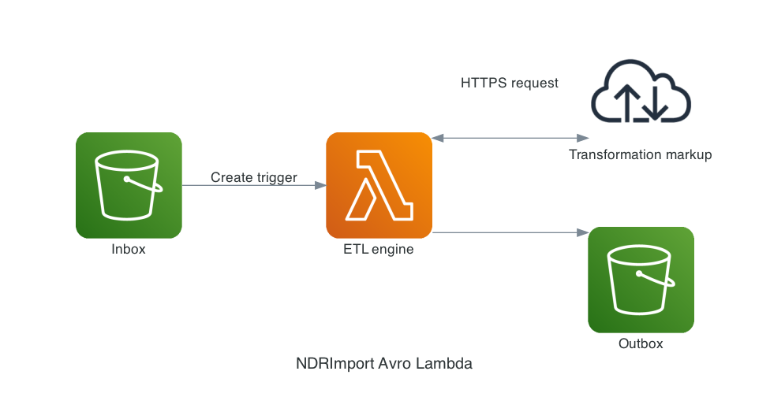

# ndr_avro-lambda

This is an image-based AWS Lambda, using [ndr_avro](https://github.com/timgentry/ndr_avro) to generate Avro files from [numerous filetypes](https://github.com/publichealthengland/ndr_import#ndrimport---).

    

## Installation

You need the AWS CLI tools installed and configured to install the lambda.

To make the AWS Linux docker container containing the Avro lambda, run:

    $ make image

Before you push to the Elastic Container Registry (ECR) you will need to log in, use:

    $ make docker-login

To push the image to ECR, use:

    $ make docker-tagpush

You will then need to:

    * create a new image-based lambda using the latest image
    * trigger the lambda from an "inbox" S3 bucket create object event
    * Add MAPPING_URL environment variable for the location of the mapping file
    * Add OUTPUT_BUCKET_NAME environment variable for where you want to save the Avro files

In testing, I gave it 1024 MB of memory (although it used less than half of that) and set a timeout of 5 minutes.

## Local Usage

To convert the sample collection CSV file `fake_dids_10.csv` to Avro format, using the `dids.yml` mapping file, run:

    $ ruby import.rb

## Contributing

Bug reports and pull requests are welcome on GitHub at https://github.com/timgentry/ndr_avro-lambda. This project is intended to be a safe, welcoming space for collaboration, and contributors are expected to adhere to the [code of conduct](https://github.com/timgentry/ndr_avro-lambda/blob/main/CODE_OF_CONDUCT.md).

## License

The gem is available as open source under the terms of the [MIT License](https://opensource.org/licenses/MIT).

## Code of Conduct

Everyone interacting in the ndr_avro-lambda project's codebases, issue trackers, chat rooms and mailing lists is expected to follow the [code of conduct](https://github.com/timgentry/ndr_avro-lambda/blob/main/CODE_OF_CONDUCT.md).
